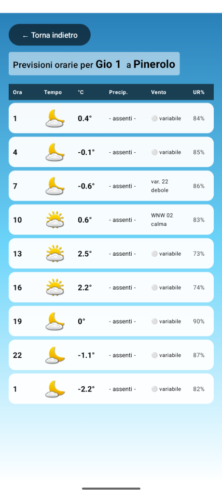

# ilMioMeteo

Un'applicazione Android semplice e pulita per consultare le previsioni meteo, basata sui dati di iLMeteo.it.

## Funzionalità

-   **Previsioni Giornaliere:** Visualizza una lista chiara delle previsioni per i prossimi 7 giorni.
-   **Dettaglio Orario Dinamico:** Consulta le fasce orarie dettagliate per ogni giorno. Il numero di fasce si adatta dinamicamente in base ai dati disponibili sul sito.
-   **Grafica Curata:** Sfondi sfumati dinamici (Giorno/Notte) e icone meteo ufficiali.
-   **Parsing Intelligente:** Il sistema analizza direttamente la pagina HTML per mostrare i dati più aggiornati compresi orari specifici e condizioni "notturne".

## Screenshots

| Schermata Principale | Dettaglio Orario |
|:---:|:---:|
|  |  |

## Note Tecniche

L'app utilizza `Jsoup` per il parsing dei dati e `Jetpack Compose` per l'interfaccia utente.
È stata ottimizzata per gestire formati orari variabili (es. "14:00" o "14") e per filtrare automaticamente righe nascoste o pubblicitarie.

## Disclaimer

Questa applicazione è stata sviluppata esclusivamente a scopo **educativo e di studio** per sperimentare con il framework Android Jetpack Compose e le tecniche di parsing HTML (Web Scraping) con la libreria Jsoup.

Il progetto **non è affiliato** in alcun modo a iLMeteo.it.
Tutti i dati meteorologici visualizzati sono proprietà esclusiva dei rispettivi detentori. L'applicazione non è intesa per uso commerciale o distribuzione pubblica su store ufficiali.
